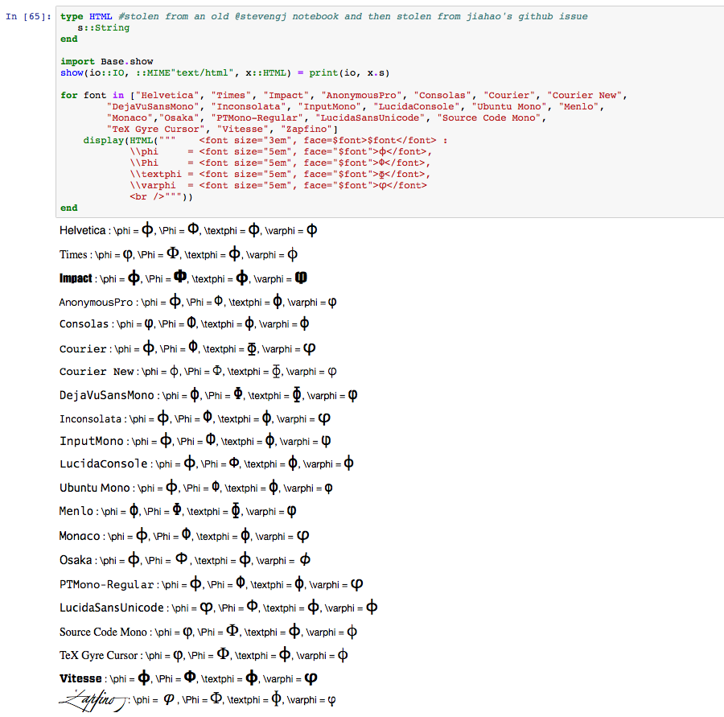
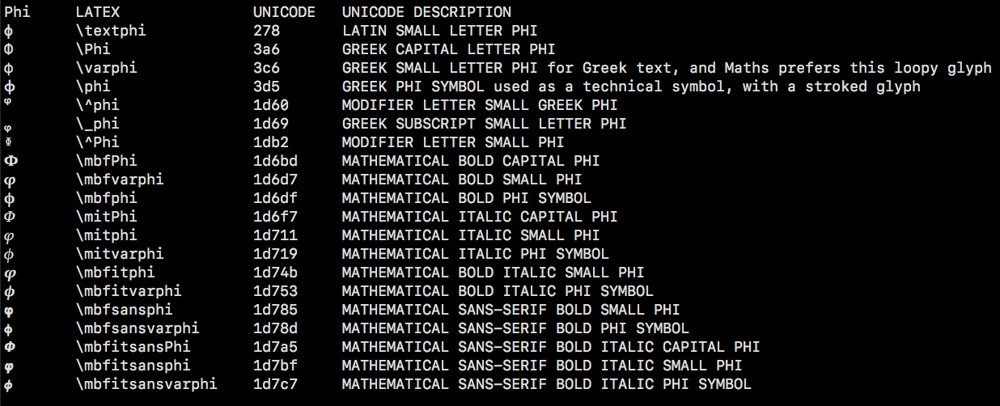

# life of phi

Here's a [Jupyter notebook](http://nbviewer.jupyter.org/github/cormullion/life-of-phi/blob/master/phi-variations.ipynb#) that examines the phi character in a bit more detail.

I got confused about all the phi characters floating around. These are some notes to help me remember the different versions.

This is a screen shot of the macOS Terminal app using Apple's San Francisco Mono font: 

